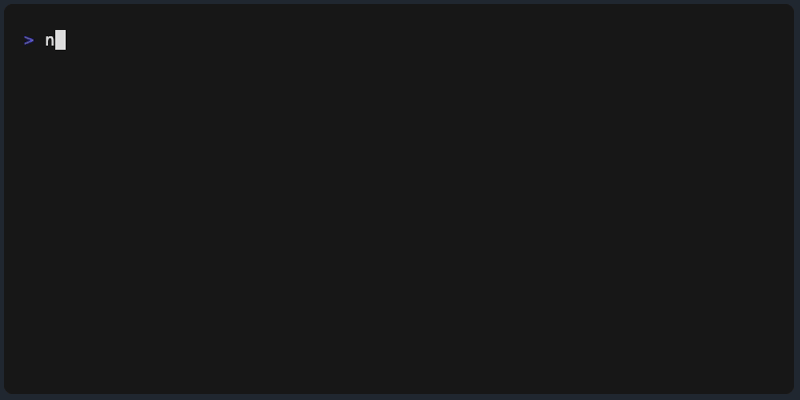

# pokemon-picker

[](#cli)
[](https://www.npmjs.com/package/pokemon-picker)
[](https://badge.fury.io/js/pokemon-picker)
[](https://www.npmjs.com/package/pokemon-picker)
[](https://packagephobia.com/result?p=pokemon-picker)
[](https://piecioshka.mit-license.org)
[](https://github.com/piecioshka/pokemon-picker/actions/workflows/testing.yml)

🎨 Pick your Pokémon from Pokédex!



I always struggle to come up with names for new projects.<br />
I had a simple idea to create a random Pokémon generator.<br />
So I made this project to randomly select Pokémon.

I use [bulbapedia.bulbagarden.net][0] to get index, name and types.<br />

**Pokémon database size: 756**


---

## Usage

Installation:

```bash
npm install pokemon-picker
```

```javascript
const pokemon = require("pokemon-picker");
```

### `pokemon.all(): Array<Pokémon>`

Returns list of Pokémons.

### `pokemon.at(index: number): Pokémon`

### `pokemon.byIndex(index: number): Pokémon`

Return Pokémon object or `undefined` value.

Parameters:

- `index` - number of create from the list.

### `pokemon.byName(name: string): Pokémon`

Returns Pokémon object or `undefined` value.

Parameters:

- `name` - Pokémon name.

### `pokemon.byType(type: string): Array<Pokémon>`

Returns list of Pokémons with type.

Parameters:

- `type` - Pokémon type.

### `pokemon.randomize(): Pokémon`

Return random "Pokémon" from whole list.

### `pokemon.size(): number`

Return number of Pokémon's, which are available in database.

## CLI

Installation:

```bash
npm install -g pokemon-picker
```

```bash
pokemon-picker --help

  Usage: pokemon-picker [options]

  Pick your Pokémon from Pokédex!

  Options:

    -h, --help     output usage information
    -V, --version  output the version number
    -a             Get whole list of Pokémons
    -i [index]     Get Pokémon by index
    -n [name]      Get Pokémon by name
    -t [type]      Get Pokémons by type
    -r             Return random Pokémon
    -s             Return number of database size
```

## Examples

```javascript
const pokemon = require("pokemon-picker");

pokemon.all(); // ... returns whole list of Pokémons

pokemon.byIndex(0); // => { "index": 1, "name": "Bulbasaur", "types": ["Grass", "Poison"] }
pokemon.at(76); // => { "index": 76, "name": "Golem", "types": ["Rock", "Ground"] }
pokemon.byIndex(151); // => { "index": 151, "name": "Mew", "types": ["Psychic"] }

pokemon.byName("Pikachu"); // => { name: 'Pikachu', types: [ 'Electric' ], index: 25 }
pokemon.byType("Fire"); // => ... list of Fire Pokémons

pokemon.size(); // 756 (all known creatures)

pokemon.randomize(); // => { "index": 135, "name": "Electabuzz", "types": ["Electric"] }
pokemon.randomize(); // => { "index": 65, "name": "Alakazam", "types": ["Psychic"] }
pokemon.randomize(); // => { "index": 38, "name": "Ninetales", "types": ["Fire"] }
```

## License

[The MIT License](https://piecioshka.mit-license.org) @ 2014

[0]: https://bulbapedia.bulbagarden.net/wiki/List_of_Pok%C3%A9mon_by_National_Pok%C3%A9dex_number
